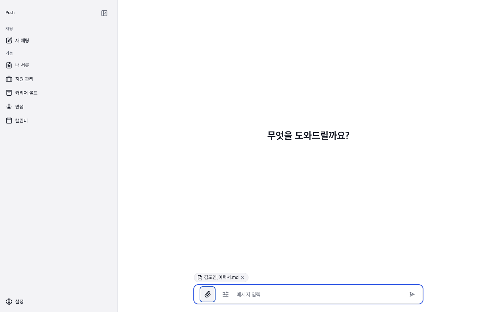
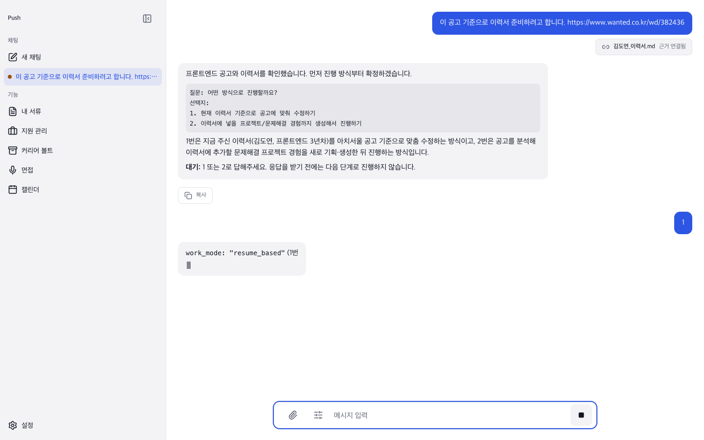

  

<h1 align="center">Push FE</h1>

  <strong>근거 기반 커리어 작업공간 Push의 프런트엔드 — Tauri 데스크톱 앱 + 웹</strong>

  React 19 · Tauri v2 · Vite · ky · TanStack Query · Zustand · vanilla-extract · TipTap

---

**push-fe**는 Push의 클라이언트다. Tauri v2 셸로 macOS 데스크톱 앱으로 실행되고, 같은 코드가 Vite로 일반 웹앱으로도 뜬다. 채팅 기반 AI 워크플로 UI, 문서 편집기, 커리어 볼트, 지원 관리, 면접 준비를 포함한다.

## 주요 기능

- **채팅 워크플로** — 공고 URL·이력서 첨부 → SSE 토큰 스트리밍 → Phase 게이트에 번호/자유 입력으로 응답
- **스트림 자동 재연결** — 다른 화면을 갔다 와도 진행 중 응답을 서버에서 다시 붙여 이어서 렌더링
- **멀티라인 컴포저** — textarea 자동 확장, Shift+Enter 줄바꿈, IME 조합 중 전송 방지, 파일 드래그·붙여넣기
- **문서 에디터** — TipTap 기반, 버전 관리, PDF/DOCX 다운로드
- **추론 설정** — 접근 모드(관리형/BYOK), 역할별(generate/research) 모델 선택, effort 조정
- **지원 관리·커리어 볼트·면접 준비** — 이력서 외 커리어 라이프사이클 전체

## 스크린샷

| | |
| --- | --- |
|  |  |
| 홈 컴포저 | 응답 스트리밍 |
|  |  |
| Fit score 게이트 | 템플릿 선택 게이트 |
|  |  |
| 이탈 후 복귀 · 스트림 재연결 | 최종 응답 · 문서보내기 칩 |
|  |  |
| 문서 편집기 · PDF/DOCX보내기 | 지원 관리 |

## 스택

- **Tauri v2** — 네이티브 데스크톱 셸 (`src-tauri`, Rust)
- **React 19 + Vite** — UI
- **ky** — API 클라이언트 (`src/shared/api`)
- **TanStack Query** — 서버 상태 (`features/*/api/hooks.ts`)
- **Zustand** — 로컬 UI 상태 (`features/*/stores.ts`)
- **vanilla-extract** — 빌드타임 CSS (`src/theme`)
- **TipTap** — 문서 에디터
- **Feature-based** — `app` / `pages` / `features` / `shared` 구조
- **Vitest + Testing Library** — 테스트
- **ESLint + Prettier** — 린트/포맷

